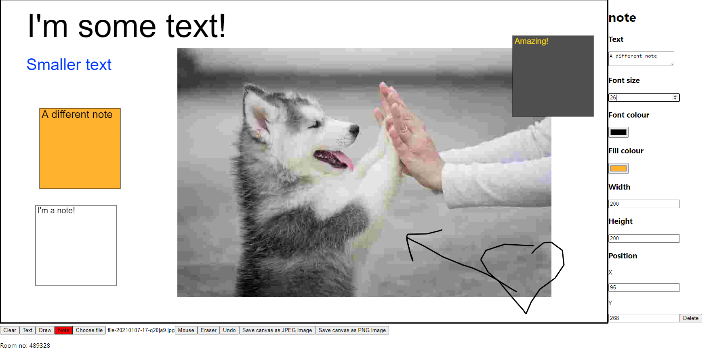

# Internet Protocols Project - Whiteboard application

A React application with a Node.js server allowing you to collaborate on a whiteboard.

## Usage
### Setup for the frontend
---
1. cd into *frontend\whiteboard*

       cd .\frontend\whiteboard\

2. Run *npm install* to install dependencies found in *frontend\whiteboard\package.json*

       npm install

3. Run *npm start* to start the server on *localhost:3000*

       npm start

### Setup for the server
---
1. cd into *server*

       cd .\server\

2. Run *npm install* to install dependencies found in *server\package.json*

       npm install

3. Run *npm start* to start the server on *localhost:5000*

       npm start

## Message structures
---
### Types of message

1. Message for joining
2. Message for disconnecting
3. Message for editing a whiteboard object

### Message for editing a whiteboard item

1. Note:

       {
              type: “note”,
              id: 123,
              text: “text”,
              fontSize: 10,
              fillColor: “#FFFFFF”,
              fontColor: “#FFFFFF”,
              action: “create”,
              height: 100,
              width: 100, 
              Coordinates: {
                     xPos: 123,
                     yPos: 123
              }
       }

2. Text:

       {
              type: “text”,
              id: 123,
              text: “text”,
              fontSize: 10,
              fontColor: “#FFFFFF”,
              action: “create”,
              height: 10,
              width: 10, 
              Coordinates: {
                     xPos: 123,
                     yPos: 123
              }
       }

3. Image:

       {
              type: “image”,
              id: 123
              action: “create”,
              imageData: data,
              height: 100,
              width: 100, 
              Coordinates: {
                     xPos: 123,
                     yPos: 123
              }
       }

4. Draw:

       {
              type: “line”,
              id: 123,
              action: “create”,
              height: 10,
              width: 10, 
              Coordinates: {
                     xPos: 123,
                     yPos: 123
              }
       }

